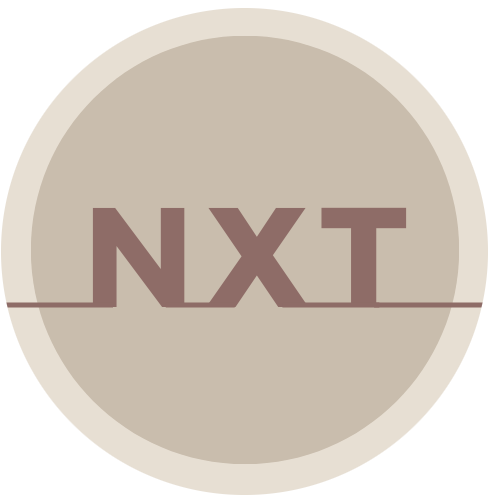

<!-- Improved compatibility of back to top link: See: https://github.com/othneildrew/Best-README-Template/pull/73 -->

<!-- PROJECT LOGO -->
 

  

<h3 align="center">NXT | What should I read next?</h3>

  

    Browse the OpenLibrary catalogue.
  

[![MIT License][license-shield]][license-url]
[![LinkedIn][linkedin-shield]][linkedin-url]

  
Index

  <ol>
    <li>
      <a href="#about-the-project">About The Project</a>
      <ul>
        <li><a href="#the-assignment">The assignment</a></li>
        <li><a href="#requirements">Requirements</a></li>
      </ul>
    </li>
    <li>
      <a href="#development">Development</a>
      <ul>
        <li><a href="#the-idea">The idea</a></li>
        <li><a href="#built-with">Built With</a></li>
      </ul>
    </li>
    <li><a href="#license">License</a></li>
    <li><a href="#contact">Contact</a></li>
  </ol>

<!-- ABOUT THE PROJECT -->

## About The Project

[![Product Name Screen Shot][product-screenshot]](https://nxt.bello.codes)

_NXT | What should I read next?_ is the final project for [start2impact](https://www.start2impact.it/)'s module "JavaScript Advanced" in the Full-stack developer course.

### The assignment:

Develop an app that allows the user to look up books of a specific category/genre. 
The app should be composed of a simple textbox and a button that calls the <strong>Subjects API</strong> of _Open Library_. Once the data is received, it should be displayed in a list of titles and authors.  Clicking a book or a related button should trigger a call to the <strong>Books API</strong> and then render the description of that specific book.

### Requirements:

- The app must be developed with JS.
- Use of external libraries is suggested but not mandatory.
- Additional features may be added if necessary.

(<a href="#readme-top">back to top</a>)

## Development

### The idea

I designed this app with a mobile-first approach keeping the components at a minimum and as clean as possible.  I opted for earthy tones to evoke the feeling of old book pages, and the font _Montserrat Subrayada_, used in the main title, reminds me of books on a shelf, I thought it as particularly fitting 😄.

I implemented <strong>four</strong> Open Library APIs (_Subjects_, _Search_, _Book_, and _Cover_) and an additional <strong>bookmark</strong> functionality through the Local Storage. The research can be made by subject, by author, or by title, and the results can expand via button. The "+" will activate the other two API calls and roll to the side, uncovering the bookmark button. The content of the card will then be displayed with a description and the book cover (hidden on small screens).

I implemented an MVC architecture, and through the project I used some methods of the Lodash library, as well as the Axios client.

### Built With

- Webpack
- Axios
- Lodash
- JavaScript
- Sass
- HTML

(<a href="#readme-top">back to top</a>)

<!-- LICENSE -->

## License

Distributed under the MIT License. See `LICENSE.txt` for more information.

(<a href="#readme-top">back to top</a>)

<!-- CONTACT -->

## Contact

Angela Bellò - [Portfolio](https://bello.codes)

Project Link: [https://github.com/angiejo21/OPENLIBRARY](https://github.com/angiejo21/OPENLIBRARY)

(<a href="#readme-top">back to top</a>)

<!-- MARKDOWN LINKS & IMAGES -->
<!-- https://www.markdownguide.org/basic-syntax/#reference-style-links -->

[license-shield]: https://img.shields.io/github/license/angiejo21/OPENLIBRARY.svg?style=for-the-badge
[license-url]: https://github.com/angiejo21/OPENLIBRARY/blob/master/LICENSE
[linkedin-shield]: https://img.shields.io/badge/-LinkedIn-black.svg?style=for-the-badge&logo=linkedin&colorB=555
[linkedin-url]: https://www.linkedin.com/in/angelabello/
[product-screenshot]: ./src/img/openlibrary.gif
